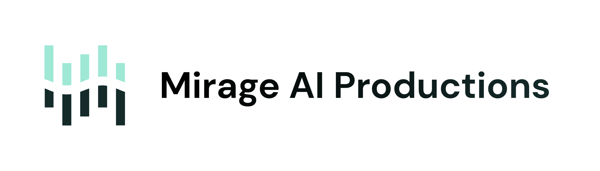
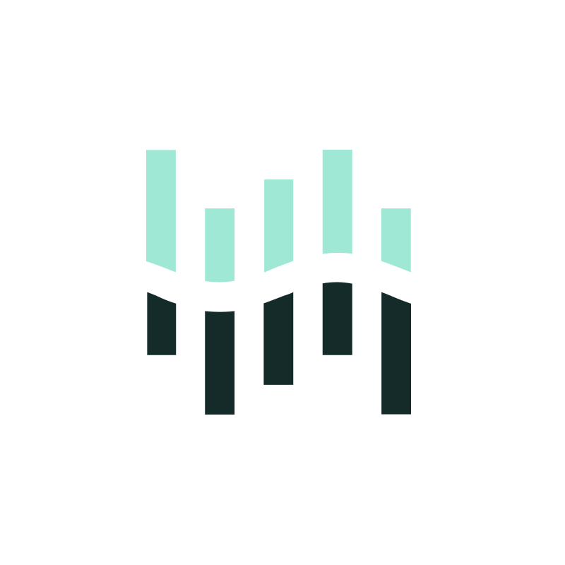

 

# Mirage AI

We, [Mirage AI](https://mirageai.xyz), are a startup building the future of entertainment by embracing AI and ML. 

## Community & Support

<!-- - [GitHub Issues](https://github.com/d-exclaimation/spotlight/issues). Best for: bugs and errors you encounter using [Spotlight](https://spotlight/d-exclaimation.me). -->
- [Email Support](mailto:support@mirageai.xyz). If you have any questions, feedback, or just want to say hi, send us an email!

## Status
 
- [x] Alpha: We are testing our products with a closed set of customers
- [x] Early access: Anyone can sign up to a waitlist and get early access, but most features are still being built
- [ ] Public Beta: Available for everyone with stable feature set, but we are still working out kinks
- [ ] Public: General Availability 

We are currently in Alpha.

<!-- ## License

Spotlight is licensed under the [MPL-2.0](/LICENSE) license.

## Acknowledgements

Special thanks to these amazing projects which help power Spotlight:

- [Vercel](https://vercel.com) for hosting the frontend and edge functions
- [Railway](https://railway.app) for hosting the backend and database
- [SvelteKit](https://kit.svelte.dev) for the frontend framework
- [tRPC](https://trpc.io) for the backend framework -->

 

Cheers, 
Mirage AI Team
  
 

[Mirage AI](https://mirageai.xyz) 
<small>Embracing the future, crafting today</small>
